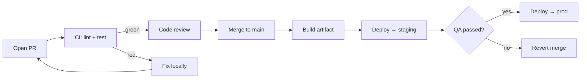
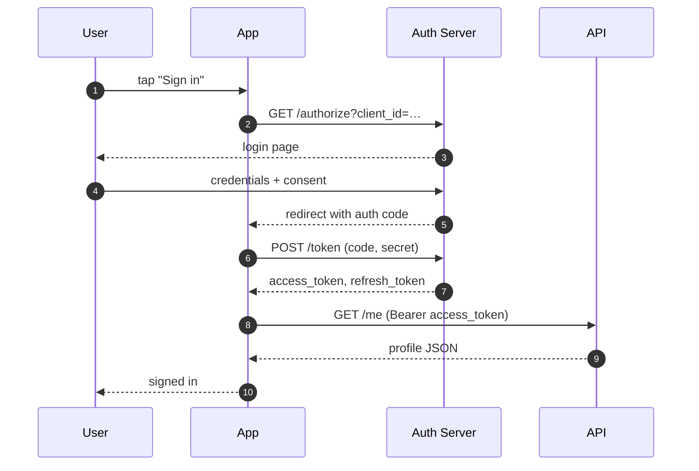
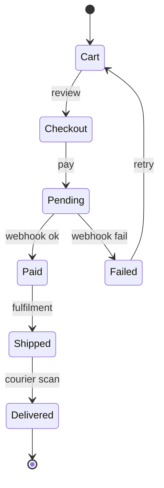
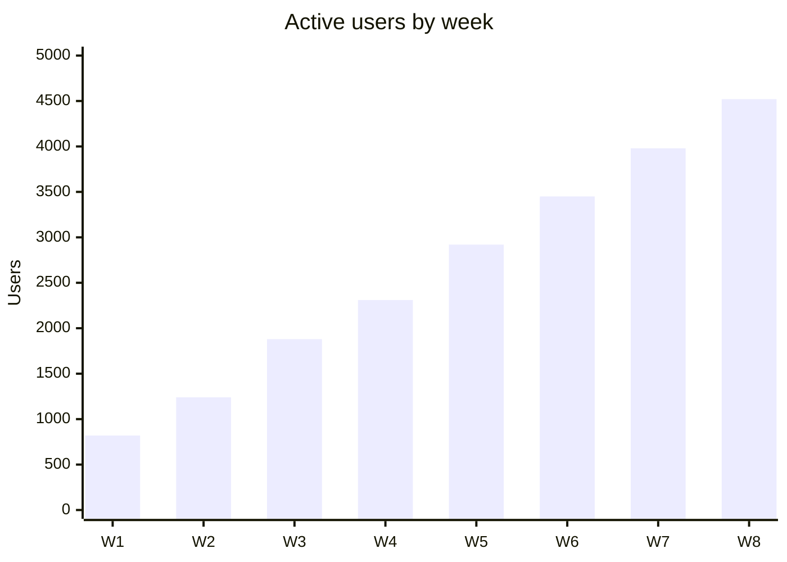

# Diagrams that just work

Marklens bundles Mermaid 11 locally — no CDN, no JavaScript console
errors, no flash of unstyled diagram. Drop a fenced code block tagged
`mermaid` and it renders inline alongside your prose.

## A deploy pipeline

## An OAuth handshake

## Order lifecycle

## A simple bar chart

Diagrams pick up the system theme automatically — light when your Mac is
in light mode, dark when it isn't.
