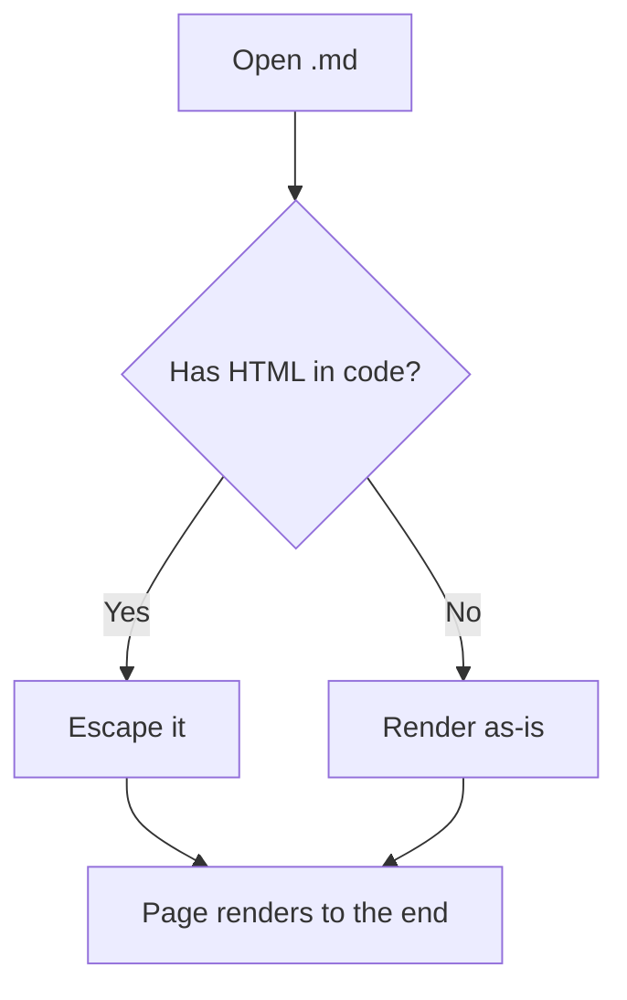
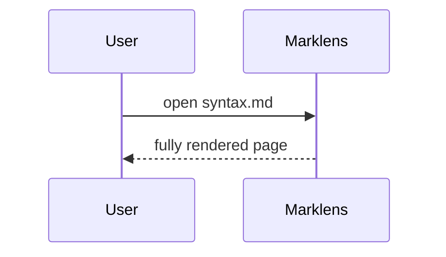

# Marklens syntax reference

A single document that exercises every construct Marklens claims to render.
Open it in the app and read top to bottom: the last line is a sentinel, and if
you can see it, nothing swallowed the rest of the page.

## Table of contents

1. [Headings](#headings)
2. [Text and emphasis](#text-and-emphasis)
3. [Literal HTML in prose and code](#literal-html-in-prose-and-code)
4. [Code blocks](#code-blocks)
5. [Blockquotes](#blockquotes)
6. [Lists](#lists)
7. [Tables](#tables)
8. [Links and images](#links-and-images)
9. [Raw HTML](#raw-html)
10. [Math](#math)
11. [Mermaid](#mermaid)

## Headings

Setext heading, level one
=========================

Setext heading, level two
-------------------------

### Level three
#### Level four
##### Level five
###### Level six

## Text and emphasis

Plain paragraph with *emphasis*, _also emphasis_, **strong**, __also strong__,
***both at once***, ~~strikethrough~~, and `inline code`.

Nested formatting: **strong with *emphasis* inside**, and `code with **asterisks**`.

Escapes keep punctuation literal: \*not emphasis\*, \_not emphasis\_, \`not code\`,
\[not a link\], \\backslash, and \#not a heading.

Hard line break after two spaces:  
this is the next line.

Hard line break after a backslash:\
and this is the next line.

Special characters that must survive as text: 5 < 6, 6 > 5, AT&T, Smith & Sons,
100% &mdash; and an entity: &copy; &amp; &lt; &gt; &quot;.

## Literal HTML in prose and code

The reported bug lived here. Every tag below is inside a **code span**, so it
must render literally — never as live markup:

`Testtag` quick `<style>` fox `</body>` jump

- `<script>alert("x")</script>`
- `<div class="box">content</div>`
- `<title>not the page title</title>`
- `<textarea>not a text box</textarea>`
- `a < b && c > d`
- `</html>`
- Double-backtick span containing a backtick: `` `nested` ``

Inline code preserves spacing and characters: `let x = a < b ? 1 : 2`.

## Code blocks

Fenced block with a language (syntax highlighted):

```swift
struct Point {
    let x: Int
    let y: Int

    func description() -> String {
        "Point(\(x), \(y))"   // note: \(x) is an interpolation, not an escape
    }
}
```

Fenced block whose content is HTML, escaped and highlighted rather than executed:

```html
<!DOCTYPE html>
<html lang="en">
  <head><style>body { color: rebeccapurple; }</style></head>
  <body>
    <div class="box">5 < 6 &amp;&amp; 6 > 5</div>
    <script>console.log("</script>");</script>
  </body>
</html>
```

Tilde fence, and a fence containing a fence:

~~~text
```
A backtick fence inside a tilde fence is literal.
```
~~~

Fence with no language:

```
plain
preformatted
text
```

Indented code block (four spaces):

    <div>&amp;</div>
    if a < b: print("less")

## Blockquotes

> A simple quote.
>
> > A nested quote.
> >
> > > Three deep.

> Quote containing other blocks:
>
> - a list item
> - another item
>
> ```swift
> let quoted = true
> ```

## Lists

Unordered, with mixed markers:

- dash item
* asterisk item
+ plus item

Ordered, starting from a non-default number:

3. third
4. fourth
5. fifth

Nested and mixed:

1. First
   - nested bullet
     - deeper bullet
2. Second
   1. nested ordered
   2. another nested ordered
3. Third

Loose list (blank lines between items):

- first paragraph

- second paragraph

- third paragraph

Task list:

- [x] parses HTML in code spans
- [x] escapes text and code
- [ ] sanitizes raw HTML

Bold-lead paragraphs, the usual stand-in for a definition list:

**Term.** A definition written as bold text plus a sentence.

**Another term.** Its definition.

## Tables

| Left | Center | Right | Inline |
|:-----|:------:|------:|:-------|
| a | b | 1 | `<style>` |
| longer cell | mid | 22 | `a < b` |
| `code` | **bold** | 333 | escaped \| pipe |

Table with alignment markers only:

| L | C | R |
|:--|:-:|--:|
| 1 | 2 | 3 |

## Links and images

Inline link: [swift-markdown](https://github.com/swiftlang/swift-markdown).

Link with a title: [Apple](https://www.apple.com "Apple homepage").

Reference link: [CommonMark spec][spec], and [collapsed][] and [shortcut].

Autolink: <https://example.com/path?query=1&other=2>.

Email autolink: <hello@example.com>.

Bare URL left as text: https://example.com/not-a-link.

In-page anchor: [back to the top](#marklens-syntax-reference).

Image (remote, may not load offline):


[spec]: https://spec.commonmark.org/
[collapsed]: https://spec.commonmark.org/0.31.2/
[shortcut]: https://example.com/

## Raw HTML

Raw HTML is passed through on purpose, because markdown allows it.

<div class="raw-block">
  <p>A raw <code>&lt;div&gt;</code> block with <strong>markup</strong> inside.</p>
</div>

Inline raw HTML such as <mark>highlighted</mark>, <kbd>⌘K</kbd>, H<sub>2</sub>O,
x<sup>2</sup>, and a forced break<br>before this text.

---

Thematic breaks above and below, in three spellings:

***

___

## Math

Inline math: $E = mc^2$, and a formula with escapes $\alpha_1 + \beta_2$.

Display math:

$$
\int_0^\infty e^{-x^2}\,dx = \frac{\sqrt{\pi}}{2}
$$

Display math with an ampersand, which also checks escaping:

$$
\begin{matrix} a & b \\ c & d \end{matrix}
$$

Currency is not math: it costs $5 and $10 today.

Math inside code is not math: `$x$` and `$$y$$`.

## Mermaid





---

If you can read this sentinel line, Marklens rendered the whole document —
including every `<style>`, `<script>` and `</body>` in the code spans above.
