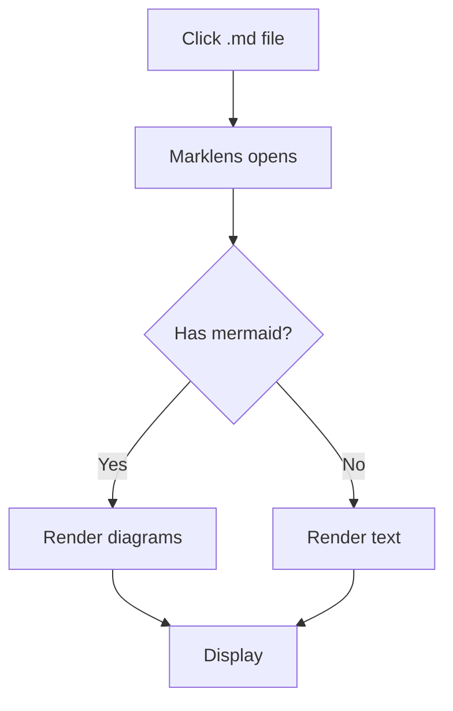
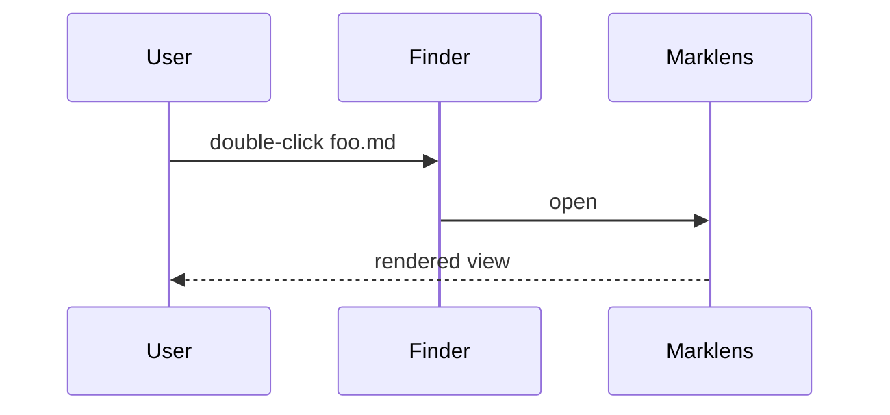

# Welcome to Marklens

A clean, fast, native Markdown viewer for macOS and iPadOS.

## Features at a glance

- Click-to-open, instant render
- Code syntax highlighting via **highlight.js**
- **Mermaid** diagrams (offline)
- GitHub-flavored Markdown: tables, task lists, strikethrough
- Light/dark theme follows the system
- Quick Look extension on macOS

## Code blocks

```swift
import SwiftUI

@main
struct MarklensApp: App {
    var body: some Scene {
        DocumentGroup(viewing: MarkdownDocument.self) { file in
            ContentView(document: file.document, fileURL: file.fileURL)
        }
    }
}
```

```python
def fib(n):
    a, b = 0, 1
    while a < n:
        print(a, end=" ")
        a, b = b, a + b
```

```rust
fn main() {
    let xs: Vec<i32> = (1..=5).collect();
    let sum: i32 = xs.iter().sum();
    println!("sum = {sum}");
}
```

## Mermaid diagram





## Tables

| Format | Supported | Notes |
|:-------|:---------:|------:|
| GFM tables  | ✓ | Alignment honored |
| Task lists  | ✓ | Read-only |
| Footnotes   | ✗ | v1 |
| Math (KaTeX)| ✗ | Future |

## Task list

- [x] Parse markdown natively (swift-markdown)
- [x] Render via WKWebView
- [x] Bundle mermaid + highlight offline
- [ ] Quick Look extension entitlement testing
- [ ] App Store submission

## Quotes

> "Simplicity is the ultimate sophistication."
> — attributed to Leonardo da Vinci

## Links

Visit [swift-markdown](https://github.com/swiftlang/swift-markdown) for the parser used to render this very file.
